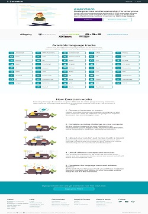

# Coding Ninja - Python
## A Curated list of Problems for Competitive Coding &amp; Interview Preparations

## Sources 

### [Elements of Programing Interview - Python](https://github.com/Vaidic/elements-of-programming-interviews-python-solutions)

### [Exercism.IO Solutions](https://github.com/Vaidic/exercism-io-solutions)

